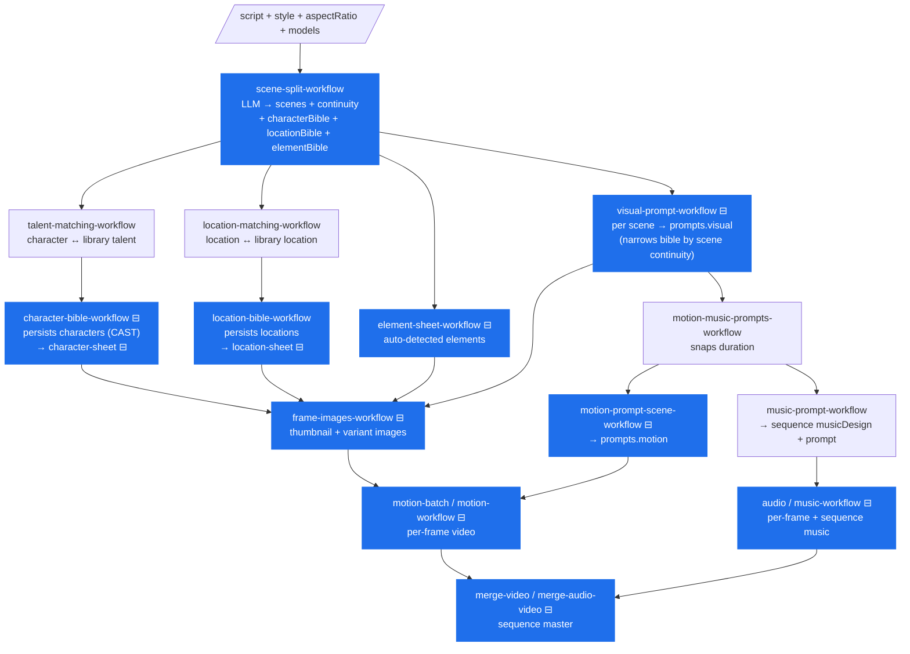
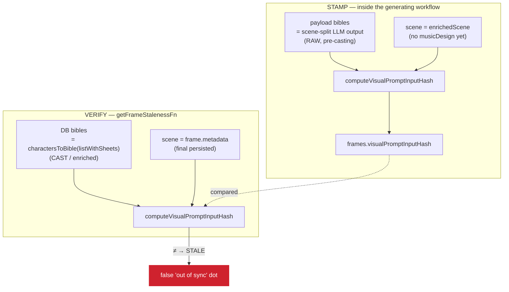
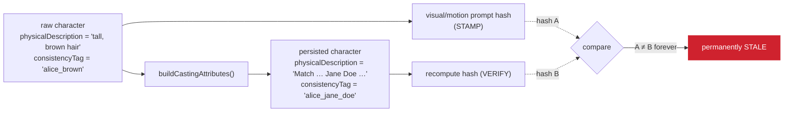

# Prompt & artifact staleness — the dependency graph

> Issue [#867](https://github.com/openstory-so/openstory/issues/867): _"When
> generating a new sequence, image and motion prompts always appear stale.
> Validate the dependency graph and hash calculation across all areas, create a
> doc that graphs it out clearly, then correct inconsistencies."_

This doc is the map. It graphs **what input, when changed, makes which artifact
stale**, and then pins down the places where the graph is computed
_inconsistently_ between the moment an artifact is generated (**stamp**) and the
moment the UI checks it (**verify**) — which is what produces the false-positive
"out of sync" dots on a brand-new sequence.

It is the operational companion to
[workflow-snapshots-and-content-hash-staleness.md](./workflow-snapshots-and-content-hash-staleness.md)
(the design) — read that first for _why_ we hash inputs at all.

## Status — implemented in #867

All three defects below are now **fixed**; §5/§6 are kept as the rationale.

1. **Membership moved upstream.** Scene-split now emits each scene's `continuity`
   (`response-schemas.ts`); the visual-prompt LLM no longer authors it. The
   visual/motion prompt workflows **narrow their bible input to the scene's
   entities before the LLM call** (`visual-prompt-scene-workflow.ts`,
   `motion-prompt-scene-workflow.ts`) — the model and the hash see the same
   minimal input.
2. **Cast bible fed into prompt generation.** `analyze-script-workflow.ts`
   computes the cast bible (`buildCastCharacterBible`) right after talent matching
   and hands it to the prompt branches, so the stamped hash equals the cast DB row
   read at verify time.
3. **Hash scoped to real drivers.** `input-hash.ts` projects each bible entry to
   its prompt-driving fields (drops `characterId`/`locationId`/`consistencyTag`/
   `firstMention`) and uses an allowlist scene surface;
   `PROMPT_INPUT_HASH_VERSION` bumped to 4.

---

## 1. The model in one paragraph

Every generated artifact stores a **SHA-256 hash of its inputs** in a nullable
column (`frames.visualPromptInputHash`, `frames.thumbnailInputHash`,
`frame_variants.inputHash`, `characters.sheetInputHash`, …). Staleness is a
**derived read**, never a stored flag:

```
stored hash == null            → "untracked"  (never generated / legacy — no opinion)
stored hash == recompute(now)  → "fresh"
stored hash != recompute(now)  → "stale"      (an input changed → show "regenerate")
```

`recompute(now)` reads the **current persisted state** and re-derives the hash.
Helpers live in [`src/lib/ai/input-hash.ts`](../../src/lib/ai/input-hash.ts).

**The invariant that must hold:** the hash computed at **stamp time** (inside the
generating workflow) and the hash computed at **verify time** (inside
`getFrameStalenessFn`) must be byte-identical _whenever nothing the user cares
about has changed_. Every false-positive in this doc is a place where stamp ≠
verify even though nothing changed.

---

## 2. The generation DAG

What feeds what, top to bottom. Each box is a durable workflow; each arrow is a
data dependency. Boxes that **stamp an input-hash** are marked `⊟`.



The two prompt artifacts this issue is about — **`prompts.visual`** and
**`prompts.motion`** — sit in the middle. Their hashes are stamped in
`visual-prompt-scene-workflow.ts` and `motion-prompt-scene-workflow.ts`.

> **Critical ordering detail (becomes inconsistency C below):**
> `character-bible-workflow` and `visual-prompt-workflow` are spawned **in
> parallel** in Phase 3 of `analyze-script-workflow.ts`
> ([`Promise.allSettled([... charSettled, ... visualSettled])`](../../src/lib/workflows/analyze-script-workflow.ts)).
> The visual prompt is therefore hashed against bibles that the character/location
> bible workflows are _simultaneously persisting in a transformed form_.

---

## 3. The staleness dependency graph (the answer to "what causes staleness")

Read every arrow as: **"if this input changes, the target artifact becomes
stale."** Diamonds are inputs; rounded boxes are hashed artifacts.

```mermaid
flowchart LR
    subgraph inputs["upstream inputs"]
        scene{{"scene input surface<br/>sceneId · sceneNumber · originalScript<br/>· metadata title/location/timeOfDay/storyBeat"}}
        style{{"styleConfig"}}
        cbible{{"character bible<br/>(name, age, physicalDescription,<br/>consistencyTag, …)"}}
        lbible{{"location bible"}}
        ebible{{"element bible"}}
        ar{{"aspectRatio"}}
        amodel{{"analysisModel"}}
        imodel{{"imageModel"}}
        vmodel{{"motionModel"}}
        amodel2{{"audioModel"}}
        dur{{"durationSeconds (snapped)"}}
        tags{{"music tags"}}
    end

    scene --> VP(["visual prompt hash"])
    style --> VP
    cbible --> VP
    lbible --> VP
    ebible --> VP
    ar --> VP
    amodel --> VP

    scene --> MP(["motion prompt hash"])
    style --> MP
    cbible --> MP
    lbible --> MP
    ebible --> MP
    ar --> MP
    amodel --> MP

    VP -. "fullPrompt text" .-> TH(["thumbnail / variant-image hash"])
    imodel --> TH
    ar --> TH
    CS(["character-sheet hash"]) --> TH
    LS(["location-sheet hash"]) -. "skipped today (gap)" .-> TH
    ER(["element-ref hash"]) --> TH

    cbible --> CS
    style --> CS
    imodel --> CS
    TS(["talent-sheet hash"]) --> CS

    lbible --> LS
    style --> LS
    imodel --> LS

    TH --> VID(["frame video hash"])
    MP -. "fullPrompt text" .-> VID
    vmodel --> VID
    dur --> VID
    ar --> VID

    MUSIC(["sequence music-prompt hash"]) --> AUD(["frame / sequence audio hash"])
    tags --> AUD
    dur --> AUD
    amodel2 --> AUD
```

Key consequences of the shape:

- **Prompts depend on the _text_ of the bibles**, not on the sheet images. Edit a
  character's `physicalDescription` and the visual + motion **prompts** go stale;
  the rendered thumbnail goes stale only because the **character-sheet hash**
  changes and feeds the thumbnail hash.
- **Image → video is a hash cascade.** The video hash includes the source image's
  hash (`FrameVideoSourceImage = { kind: 'variantHash'; hash }`), so a stale image
  invalidates its motion without the video needing to know _why_ the image changed.
- **`durationSeconds` deliberately feeds video/audio but NOT prompts** — it's a
  generation parameter, not a prompt driver. (Fixed in #767; see §5-B.)

---

## 4. Per-artifact hash inputs (authoritative reference)

Source of truth: [`src/lib/ai/input-hash.ts`](../../src/lib/ai/input-hash.ts).

Listed in generation order (matching §4.1):

| Artifact                      | Stamp site                                                | Verify site                                              | Hashed inputs                                                                                                                           |
| ----------------------------- | --------------------------------------------------------- | -------------------------------------------------------- | --------------------------------------------------------------------------------------------------------------------------------------- |
| **Talent sheet** (library)    | `library-talent-sheet-workflow`                           | sheet-staleness reads                                    | talent name/description, referenceMediaHashes (sorted set), imageModel                                                                  |
| **Character sheet**           | `character-sheet-workflow`                                | sheet-staleness reads                                    | character bible fields, talentSheetHash, styleConfigHash, imageModel                                                                    |
| **Location sheet**            | `location-sheet-workflow`                                 | sheet-staleness reads                                    | location bible fields, libraryLocationReferenceHash, styleConfigHash, imageModel                                                        |
| **Visual prompt**             | `visual-prompt-scene-workflow.ts`                         | `getFrameStalenessFn` (`functions/frames.ts`)            | scene input surface, styleConfig, character/location/element bibles (narrowed), aspectRatio, analysisModel, `PROMPT_INPUT_HASH_VERSION` |
| **Motion prompt**             | `motion-prompt-scene-workflow.ts`                         | `getFrameStalenessFn`                                    | _same as visual_                                                                                                                        |
| **Sequence music prompt**     | `music-prompt-workflow`                                   | sequence music checks                                    | sceneSummaries, analysisModel                                                                                                           |
| **Thumbnail / variant image** | `frame-images-workflow.ts` / `image-workflow-snapshot.ts` | `getFrameStalenessFn` via `buildRegenerateFrameSnapshot` | effective visual prompt text, imageModel, aspectRatio, size, seed, characterSheetHashes, locationSheetHashes, elementReferenceHashes    |
| **Frame video**               | `motion-workflow*`                                        | `frameVariants.isStale`                                  | sourceImage (variant hash or URL), motion prompt text, motionModel, durationSeconds, fps, aspectRatio                                   |
| **Frame / sequence audio**    | `music-workflow`                                          | `frameVariants.isStale` / sequence checks                | musicPrompt, tags (sorted set), durationSeconds, audioModel                                                                             |

Two cross-cutting normalizations make the hash order-insensitive and
default-stable:

- `canonicalize()` sorts object keys and **throws** on `undefined` (callers must
  pass `null` / `''`).
- Set-like fields (sheet-hash lists, music tags, bibles) are sorted before
  hashing — bibles by their identity field (`characterId` / `locationId` /
  `token`).

### 4.1 The exact bytes hashed, per artifact (in generation order)

Every helper builds **one plain object** and runs it through
`canonicalize()` (recursively sort keys, **throw** on `undefined`) →
`JSON.stringify` → `crypto.subtle.digest('SHA-256')` → hex. The literal object
below _is_ the hash input — nothing else is mixed in. Two shared normalizers
appear throughout:

```ts
const trim = (s) => (s ?? '').trim(); // nullish → '', then trim
const sortedRefs = (refs) => [...(refs ?? [])].sort(); // order-insensitive set
```

> **The staleness graph is narrower than the generation DAG.** The **script**
> and the **scene** are not hashed as standalone artifacts — they enter the
> graph only as _inputs_ to the **prompt** hashes (the prompt's `scene` surface
> embeds `originalScript`). Each artifact below hashes its **direct** inputs —
> the _persisted entities_ (bibles, sheets, style, models), **not** the upstream
> script those entities were derived from.
>
> **Concretely:** editing a scene's script flips the **visual + motion prompt**
> hashes (script text is in `scene.originalScript`), but does **NOT** flip the
> **character bible / sheet** — the sheet hash contains the character's own
> persisted fields, not the script. There is no `script → bible` edge in the
> staleness graph today. The same is true for `script → location/element bible`.
> If we want a script edit to flag the bibles, that edge has to be added
> explicitly (it isn't a hash input today).

The hashed artifacts, ordered by when they are produced in the pipeline (§2):

#### Library assets — generated outside this sequence; feed the cascade

These pre-exist a given sequence (a talent or library-location is created once in
the team library) and flow downstream as a single **hash**, not their full
contents, so regenerating them with identical inputs doesn't churn dependents.

**Talent sheet — `computeTalentSheetInputHash`**

```ts
sha256Hex({
  artifact: 'talent:sheet',
  talent: { name: trim(name), description: trim(description) },
  referenceMediaHashes: sortedRefs(referenceMediaHashes), // unordered set of talent_media rows
  imageModel,
});
```

**Library-location reference — `computeLibraryLocationReferenceInputHash`**

```ts
sha256Hex({
  artifact: 'library-location:reference',
  locationBible: { name: trim(name), description: trim(description) },
  styleConfigHash,
  imageModel,
});
```

#### 1. Character sheet — `computeCharacterSheetInputHash`

Generated in Phase 3 from the (cast) character bible + the matched talent sheet.

```ts
sha256Hex({
  artifact: 'character:sheet',
  characterBible: {
    // a SUBSET of the bible entry — note no id/firstMention
    name: trim(name),
    age: trim(age),
    gender: trim(gender),
    ethnicity: trim(ethnicity),
    physicalDescription: trim(physicalDescription),
    standardClothing: trim(standardClothing),
    distinguishingFeatures: trim(distinguishingFeatures),
    consistencyTag: trim(consistencyTag),
  },
  talentSheetHash: talentSheetHash ?? null, // ← cascade from the talent sheet above
  styleConfigHash, // hash of the StyleConfig, not the object
  imageModel,
});
```

#### 2. Location sheet — `computeLocationSheetInputHash`

```ts
sha256Hex({
  artifact: 'location:sheet',
  locationBible: { name: trim(name), description: trim(description) }, // only these two fields
  libraryLocationReferenceHash: libraryLocationReferenceHash ?? null, // ← cascade from library loc
  styleConfigHash,
  imageModel,
});
```

#### 3. Visual prompt — `computeVisualPromptInputHash`

Generated in Phase 3 from the scene + the bibles. This and the motion prompt are
the artifacts #867 is about.

```ts
sha256Hex({
  artifact: 'frame:visual-prompt',
  hashVersion: 4, // PROMPT_INPUT_HASH_VERSION — bumped for the #867 body change
  scene: sceneInputContext(scene), // allowlist — see expansion below
  styleConfig, // the whole StyleConfig object, verbatim
  characterBible, // sorted by characterId, then PROJECTED to driving fields
  locationBible, //  sorted by locationId,  then PROJECTED to driving fields
  elementBible, //   sorted by token, projected, or null if absent
  aspectRatio: trim(aspectRatio),
  analysisModel: trim(analysisModel), // e.g. 'anthropic/claude-haiku-4.5'
});
```

**What `sceneInputContext(scene)` keeps (post-#867: an allowlist)** — only the
genuine pre-prompt inputs, so no downstream field can leak in:

```ts
{
  sceneId,
  sceneNumber,
  originalScript: { extract, dialogue: [{ character, line, tone }] },  // ← the script
  metadata: { title, location, timeOfDay, storyBeat },                 // no durationSeconds
}
// Everything else on the scene — prompts, continuity, musicDesign, audioDesign,
// sourceImageUrl — is downstream output and is NOT in the allowlist.
```

**Bible entries are projected to their prompt-driving fields (post-#867)** —
entries are still sorted by their identity field, but only the fields that shape
the prose are hashed; identity / provenance / image-gen tags are dropped:

```ts
// character → 7 driving fields (drops characterId, consistencyTag)
{
  (name,
    age,
    gender,
    ethnicity,
    physicalDescription,
    standardClothing,
    distinguishingFeatures);
}

// location → 9 driving fields (drops locationId, consistencyTag, firstMention)
{
  (name,
    type,
    timeOfDay,
    description,
    architecturalStyle,
    keyFeatures,
    colorPalette,
    lightingSetup,
    ambiance);
}

// element → 2 driving fields (drops consistencyTag, firstMention)
{
  (token, description);
}
```

The LLM still receives the full, narrowed entries; only the **hash** is the
projection. Combined with the cast bible feeding generation, a casting rewrite no
longer flips the prompt hash (`physicalDescription` is now identical on both
sides; `consistencyTag` is no longer hashed at all).

> The bibles are first **narrowed** to the entries this scene references
> (`narrowFramePromptContext`) and then **sorted** by identity field, but the
> entries themselves are hashed field-for-field. A single differing character
> field (e.g. a cast `physicalDescription`) flips the whole digest.

#### 4. Motion prompt — `computeMotionPromptInputHash`

Generated in Phase 4. **Byte-identical to the visual body except the
discriminator** — `artifact: 'frame:motion-prompt'`. Same scene surface, same
bibles, same style, aspectRatio, analysisModel, hashVersion. (So a change that
staleness-flags the visual prompt also flags the motion prompt — they share an
input surface.)

#### 5. Sequence music prompt — `computeMusicPromptInputHash`

Generated in Phase 4 alongside motion prompts.

```ts
sha256Hex({
  artifact: 'sequence:music-prompt',
  hashVersion: 3,
  sceneSummaries, // the compact MusicSceneSummary[] fed to the music LLM
  analysisModel: trim(analysisModel),
});
```

#### 6. Thumbnail / variant image — `computeFrameImageInputHash`

Rendered from the visual prompt text + the character/location sheet hashes.

```ts
sha256Hex({
  artifact: `frame:${kind}`, // 'frame:thumbnail' | 'frame:variant-image'
  visualPrompt: trim(visualPrompt), // the composed fullPrompt TEXT (not the prompt hash)
  imageModel,
  aspectRatio,
  size: size ?? null,
  seed: seed ?? null,
  characterSheetHashes: sortedRefs(characterSheetHashes), // ← cascade: each = characters.sheetInputHash
  locationSheetHashes: sortedRefs(locationSheetHashes), // ⚠️ omitted today (snapshot gap)
  elementReferenceHashes: sortedRefs(elementReferenceHashes),
});
```

#### 7. Frame video — `computeFrameVideoInputHash`

Rendered from the source image + the motion prompt text.

```ts
sha256Hex({
  artifact: 'frame:video',
  // the upstream image, as a HASH not a URL when possible:
  sourceImage:
    { kind: 'variantHash', hash: trim(hash) } | //   ← cascade: image change → video stale
    { kind: 'url', url: trim(url) }, //   external asset with no hashable upstream
  motionPrompt: trim(motionPrompt), // composed motion fullPrompt TEXT
  motionModel,
  durationSeconds, // hashed HERE (the snapped value) — not in the prompt hash
  fps: fps ?? null,
  aspectRatio,
});
```

#### 8. Frame audio — `computeFrameAudioInputHash`

```ts
sha256Hex({
  artifact: 'frame:audio',
  musicPrompt: trim(musicPrompt),
  tags: sortedRefs(tags), // unordered set of music tags
  durationSeconds,
  audioModel,
});
```

#### 9. Sequence music track — `computeSequenceMusicInputHash`

```ts
sha256Hex({
  artifact: 'sequence:music',
  prompt: trim(prompt),
  tags: trim(tags), // comma-joined string from sequences.musicTags
  durationSeconds,
  audioModel,
});
```

### 4.2 Hashed surface vs. actual prompt inputs — are we over-hashing?

A correct staleness hash should cover **exactly** the inputs that, if changed,
would change the regenerated prompt — no more (over-hash → false "stale"), no
less (under-hash → missed staleness). Here is the visual-prompt hash measured
against what the prompt LLM is _actually handed_.

The LLM call passes these template variables
([`visual-prompt-scene-workflow.ts`](../../src/lib/workflows/visual-prompt-scene-workflow.ts),
`getChatPrompt('phase/visual-prompt-scene-generation-chat', …)`):
`sceneBefore`, `sceneAfter`, `scene`, `characterBible`, `locationBible`,
`elementBible`, `styleConfig`, `aspectRatio` — and the bibles passed to the LLM
are the **full, un-narrowed** payload bibles. (Motion prompt: same variables.)
Narrowing is applied **only to the hash**, never to the LLM call.

| LLM receives                                                                                                                                                                             | Real prompt driver?                                        | In the hash?                            | Verdict                                                                                          |
| ---------------------------------------------------------------------------------------------------------------------------------------------------------------------------------------- | ---------------------------------------------------------- | --------------------------------------- | ------------------------------------------------------------------------------------------------ |
| `scene` appearance surface (`originalScript`, metadata `title`/`location`/`timeOfDay`/`storyBeat`)                                                                                       | yes                                                        | yes                                     | ✅ aligned                                                                                       |
| `scene.metadata.durationSeconds`                                                                                                                                                         | no (video param)                                           | no — stripped                           | under-hash, intentional (#767)                                                                   |
| `sceneBefore` / `sceneAfter` (neighbour scenes)                                                                                                                                          | **yes** (continuity context)                               | **no**                                  | ⚠️ **under-hash** — editing a neighbour's script can change this prompt, but it won't be flagged |
| **all** character / location / element entries                                                                                                                                           | yes (LLM sees the full set as context)                     | **narrowed** to referenced entries      | ⚠️ under-hash on unreferenced entries (intentional, #683)                                        |
| referenced entry → appearance fields (`name`, `age`, `gender`, `ethnicity`, `physicalDescription`, `standardClothing`, `distinguishingFeatures`; location `description`/`keyFeatures`/…) | yes                                                        | yes (whole entry)                       | ✅ aligned                                                                                       |
| referenced entry → **provenance / identity / tags** (`characterId`, `locationId`, `consistencyTag`, `firstMention`)                                                                      | **no** — internal IDs, an image-gen tag, script provenance | **yes** (rides in the whole-entry hash) | 🔴 **over-hash**                                                                                 |
| `styleConfig` (all fields)                                                                                                                                                               | mostly                                                     | yes (full)                              | ✅ (possible minor over-hash if the template ignores a field)                                    |
| `aspectRatio`, `analysisModel`                                                                                                                                                           | yes                                                        | yes                                     | ✅ aligned                                                                                       |

**Net:** the hash is **narrower** than the real LLM input in scope (it drops
`sceneBefore`/`sceneAfter`, `durationSeconds`, and unreferenced entries) but
**wider** per-entry — it carries bible fields that don't drive the prompt prose.

**Why the over-hash matters for #867:** `consistencyTag` is one of the two fields
`buildCastingAttributes` rewrites (the other is `physicalDescription`). So even
setting aside the raw-vs-cast _source_ asymmetry (§5-A), the prompt hash flips
when casting rewrites the tag — a field the prompt text doesn't use. The same
shape bites on benign churn: re-extracting continuity can shift
`firstMention.lineNumber`, and that alone would flag every location-bearing
prompt stale. Hashing only the **prompt-driving projection** of each bible entry
(appearance/description fields; drop IDs, `consistencyTag`, `firstMention`)
removes this whole false-positive class.

> This does **not** fully resolve #867 by itself — `physicalDescription` is _also_
> cast-rewritten and _is_ a genuine driver, so it would still flip under the
> source asymmetry. The source fix (§6-1) remains primary; the projection (§6-5)
> is a complementary tightening that also fixes the `firstMention` /
> `consistencyTag` churn classes.

This becomes **correction #5** in §6.

---

## 5. Where stamp ≠ verify — the inconsistencies

The symmetry contract from §1 says: _for the same logical inputs, the stamp-time
hash and the verify-time hash must be identical._ The two sides reconstruct the
hash from **different sources**, and that is where it breaks:



### A. Casting / enrichment asymmetry — **the #867 root cause** 🔴

The visual & motion prompt hashes are stamped from the **raw scene-split
character bible** carried in the workflow payload. But the
`character-bible-workflow` **rewrites** several of those exact fields when it
persists the character, via
[`buildCastingAttributes`](../../src/lib/prompts/character-prompt.ts) whenever a
character is matched to library talent:

| field                          | raw scene-split value (hashed at stamp) | persisted value (hashed at verify)                                            |
| ------------------------------ | --------------------------------------- | ----------------------------------------------------------------------------- |
| `physicalDescription`          | script-derived text                     | `"Match the real-world appearance of {talent} exactly…"` (or talent metadata) |
| `consistencyTag`               | LLM tag e.g. `detective_sarah_blonde`   | `{characterId}_{slugify(talentName)}`                                         |
| `age` / `gender` / `ethnicity` | script values                           | talent metadata when present                                                  |



Because casting is applied at **persist** time but not at **stamp** time, the two
hashes can never agree — the prompt is reported stale **immediately, with nothing
edited, on every sequence that has a talent-matched character.** A developer or
team with a populated talent library hits this on _every_ sequence, which reads
as "always stale."

The same shape (stamp = raw payload, verify = transformed DB row) is latent for
any future bible enrichment, and partially present for library-location matches.

> Note: `#683` already made both sides call `narrowFramePromptContext` so that
> _unreferenced_ entities don't poison the hash. That fixed a real bug but is
> orthogonal: narrowing selects the same _set_ of entities; this issue is that
> the selected entities have **different field values** on each side.

### B. Denylist scene-input surface — latent fragility 🟡

`sceneInputContext()` in `input-hash.ts` strips downstream LLM output from the
scene before hashing, but it does so with a **denylist**:

```ts
// strips: prompts, continuity, metadata.durationSeconds
// LEAVES IN: musicDesign, audioDesign, sourceImageUrl
```

Those left-in fields are _also_ downstream outputs. They aren't written back into
`frame.metadata` today (so this isn't currently firing), but the moment any code
path persists a "complete scene" — e.g. writing `musicDesign` or a generated
`sourceImageUrl` onto the frame — every prompt hash silently flips stale. This is
exactly the failure mode of #767 (`durationSeconds`), one field over. A
**denylist invites the next #767**; an **allowlist** closes the class.

### C. Visual-parallel vs motion-sequential ordering 🟡

`visual-prompt-workflow` runs **in parallel** with the bible workflows that
persist the cast characters, whereas `motion-prompt-scene-workflow` runs in a
**later phase**, after those bibles are persisted. So the two prompt hashes are
stamped against subtly different views of the world even though they're supposed
to hash the same bibles. The correct DAG has prompt generation **depend on**
finalized bibles, not race them.

---

## 6. Recommended corrections

Ordered by value / risk.

1. **Stamp prompt hashes from the same representation verify reads (fixes A).**
   The persisted character/location bible is the canonical "current inputs"; the
   transient scene-split payload is not. Feed the **cast** character bible (the
   output of `buildCastingAttributes`, computed once in `analyze-script-workflow`
   after talent matching) to the visual + motion prompt workflows, so the value
   hashed at stamp time equals the value persisted and re-hashed at verify time.
   This also means the prompt LLM sees the cast character — arguably more correct.
   _Single source of truth for the bible removes the asymmetry by construction._

2. **Convert `sceneInputContext` to an allowlist (fixes B).** Hash only the genuine
   pre-prompt scene inputs — `sceneId`, `sceneNumber`, `originalScript`, and
   `metadata.{title, location, timeOfDay, storyBeat}` — so no future downstream
   field can poison the prompt hash. Backward-compatible: for a scene with none of
   `musicDesign`/`audioDesign`/`sourceImageUrl`, the allowlist output is identical
   to today's denylist output, so existing fresh hashes stay fresh.

3. **Re-order the DAG so prompts depend on finalized bibles (addresses C).** Make
   `visual-prompt-workflow` consume the persisted/cast bibles rather than racing
   their persistence. Larger change; do it once 1–2 land if any residual flake
   remains.

4. **Add a stamp↔verify round-trip test.** Today's `prompt-context.test.ts` reuses
   the _same_ bible objects on both sides, so it can't catch a source-asymmetry.
   Add a test that stamps from a raw payload bible and verifies from a
   `charactersToBible(persistedCastRow)` bible and asserts the hashes match.

5. **Hash only the prompt-driving projection of each bible entry (tightens §4.2).**
   The prompt hash currently embeds whole bible entries, including fields the
   prompt prose never uses — `characterId`, `locationId`, `consistencyTag`,
   `firstMention`. Project each entry to its appearance/description fields before
   hashing. This removes a class of false positives (`consistencyTag` casting
   churn, `firstMention.lineNumber` drift on re-extraction) independent of the
   source fix. Mirror the projection on both stamp and verify sides so they stay
   symmetric.

### Known gap, not a #867 fix (tracked, deferred)

- **Neighbour-scene under-hash.** The prompt LLM is fed `sceneBefore`/`sceneAfter`
  for continuity, but the hash ignores them — so editing scene _N_'s script can
  change scene _N±1_'s regenerated prompt without flagging it stale. Opposite
  failure mode (missed staleness, not false positive); low impact. Add the
  neighbouring scenes' input surface to the hash only if this becomes a real
  complaint — it widens the invalidation blast radius, so it's a deliberate
  trade, not an obvious win.

---

## 7. Quick reference — file map

| Concern                                  | File                                                                          |
| ---------------------------------------- | ----------------------------------------------------------------------------- |
| Hash helpers + `sceneInputContext`       | `src/lib/ai/input-hash.ts`                                                    |
| Prompt context load + narrowing          | `src/lib/ai/prompt-context.ts`                                                |
| Bible builders (DB → bible, verify side) | `src/lib/ai/bibles-from-scoped.ts`                                            |
| Casting transform                        | `src/lib/prompts/character-prompt.ts` (`buildCastingAttributes`)              |
| Visual prompt stamp                      | `src/lib/workflows/visual-prompt-scene-workflow.ts`                           |
| Motion prompt stamp                      | `src/lib/workflows/motion-prompt-scene-workflow.ts`                           |
| Bible persistence (cast)                 | `src/lib/workflows/character-bible-workflow.ts`, `location-bible-workflow.ts` |
| Pipeline orchestration                   | `src/lib/workflows/analyze-script-workflow.ts`                                |
| Staleness verify (prompts + thumbnail)   | `src/functions/frames.ts` (`getFrameStalenessFn`)                             |
| Thumbnail snapshot hash                  | `src/lib/workflows/regenerate-frames-snapshot.ts`                             |
| Design rationale                         | `docs/architecture/workflow-snapshots-and-content-hash-staleness.md`          |
