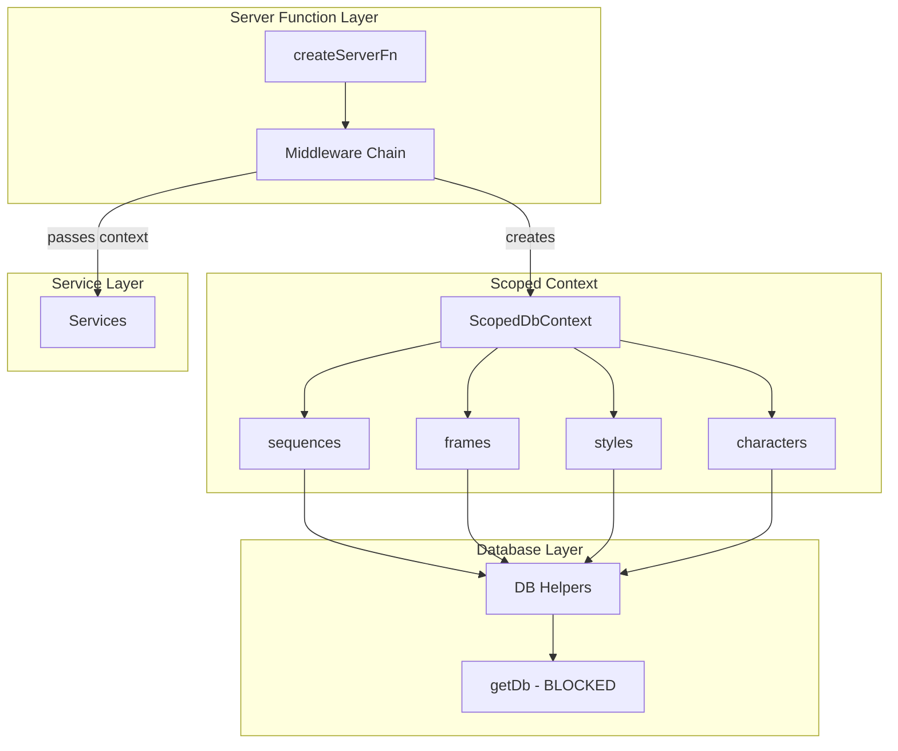

# Scoped DB Context Implementation

## Architecture Overview



**Key principle**: Server functions and services never call `getDb()` directly. All database access goes through `context.db` which is pre-scoped to the authenticated team.

---

## Phase 1: Create Scoped DB Context

### 1.1 Create types and factory

Create `src/lib/db/scoped-context.ts`:

```typescript
import type { Frame, Sequence, Style, Character } from '@/lib/db/schema';
import { AuthorizationError } from '@/lib/errors';

export interface ScopedDbContext {
  readonly teamId: string;
  readonly userId: string;

  sequences: {
    get(id: string, includeFrames?: boolean): Promise<Sequence>;
    list(): Promise<Sequence[]>;
    create(data: CreateSequenceParams): Promise<Sequence>;
    update(id: string, data: UpdateSequenceParams): Promise<Sequence>;
    delete(id: string): Promise<void>;
  };

  frames: {
    get(id: string): Promise<Frame>;
    listBySequence(sequenceId: string): Promise<Frame[]>;
    create(data: CreateFrameParams): Promise<Frame>;
    createBulk(data: NewFrame[]): Promise<Frame[]>;
    update(id: string, data: UpdateFrameParams): Promise<Frame>;
    delete(id: string): Promise<void>;
    reorder(sequenceId: string, orders: FrameOrder[]): Promise<void>;
  };

  styles: {
    get(id: string): Promise<Style>;
    list(): Promise<Style[]>;
    listWithPublic(): Promise<Style[]>;
    create(data: CreateStyleParams): Promise<Style>;
    update(id: string, data: UpdateStyleParams): Promise<Style>;
    delete(id: string): Promise<void>;
  };

  characters: {
    get(id: string): Promise<Character>;
    list(): Promise<Character[]>;
    create(data: CreateCharacterParams): Promise<Character>;
    update(id: string, data: UpdateCharacterParams): Promise<Character>;
    delete(id: string): Promise<void>;
  };
}

export function createScopedDb(teamId: string, userId: string): ScopedDbContext;
```

Each method includes authorization checks:

- `get()` methods verify `resource.teamId === teamId`
- `list()` methods filter by `teamId`
- `create()` methods set `teamId` automatically
- `update()/delete()` verify ownership before mutating

### 1.2 Add AuthorizationError

Add to `src/lib/errors.ts`:

```typescript
export class AuthorizationError extends Error {
  constructor(message = 'Access denied', details?: Record<string, unknown>) {
    super(message, 'AUTHORIZATION_ERROR', 403, details);
  }
}
```

---

## Phase 2: Update Middleware

### 2.1 Extend context types

Update `src/functions/middleware.ts`:

```typescript
import { createScopedDb, type ScopedDbContext } from '@/lib/db/scoped-context';

export type TeamContext = AuthContext & {
  teamId: string;
  db: ScopedDbContext; // Add scoped context
};

export type SequenceContext = TeamContext & {
  sequence: Sequence;
};

export type FrameContext = SequenceContext & {
  frame: Frame;
};
```

### 2.2 Update authWithTeamMiddleware

```typescript
export const authWithTeamMiddleware = createMiddleware({ type: 'function' })
  .middleware([authMiddleware])
  .server(async ({ next, context }) => {
    const team = await getUserDefaultTeam(context.user.id);
    if (!team) throw new Error('No team found for user');

    return next({
      context: {
        teamId: team.teamId,
        db: createScopedDb(team.teamId, context.user.id),
      },
    });
  });
```

### 2.3 Update resource middleware to also provide db

Both `sequenceAccessMiddleware` and `frameAccessMiddleware` should provide `context.db` scoped to the resource's team.

---

## Phase 3: Refactor Services

Convert services from singletons to context-receiving functions.

### 3.1 SequenceService

Update `src/lib/services/sequence.service.ts`:

**Before:**

```typescript
export class SequenceService {
  async getSequence(sequenceId: string): Promise<Sequence> {
    // Direct DB access - no auth check
  }
}
export const sequenceService = new SequenceService();
```

**After:**

```typescript
export function createSequenceService(db: ScopedDbContext) {
  return {
    async getSequence(sequenceId: string, includeFrames = false) {
      return db.sequences.get(sequenceId, includeFrames);
    },
    async createSequence(params: CreateSequenceParams) {
      return db.sequences.create(params);
    },
    // ... other methods use db.sequences.*
  };
}

export type SequenceService = ReturnType<typeof createSequenceService>;
```

### 3.2 FrameService

Update `src/lib/services/frame.service.ts`:

```typescript
export function createFrameService(db: ScopedDbContext) {
  return {
    async getFrame(frameId: string) {
      return db.frames.get(frameId);
    },
    async getFramesBySequence(sequenceId: string) {
      return db.frames.listBySequence(sequenceId);
    },
    // Pure methods (no DB) can remain as-is
    getVisualPrompt(frame: Frame): string | null { ... },
    enrichFrameWithSignedUrls(frame: Frame): Promise<Frame> { ... },
  };
}
```

### 3.3 Other Services

- `character.service.ts` - Same pattern
- `team.service.ts` - Same pattern
- `email-service.ts` - Remains unchanged (no DB, external API)
- `script-analysis-audit.service.ts` - Evaluate if needs scoping

---

## Phase 4: Migrate Server Functions

### 4.1 Sequences

Update `src/functions/sequences.ts`:

**Before:**

```typescript
export const getSequenceFn = createServerFn({ method: 'GET' })
  .middleware([authMiddleware])
  .inputValidator(zodValidator(getSequenceInputSchema))
  .handler(async ({ data, context }) => {
    const seq = await getSequenceById(data.sequenceId);
    if (!seq) throw new Error('Sequence not found');
    await requireTeamMemberAccess(context.user.id, seq.teamId);
    return sequenceService.getSequence(data.sequenceId, data.includeFrames);
  });
```

**After:**

```typescript
export const getSequenceFn = createServerFn({ method: 'GET' })
  .middleware([authWithTeamMiddleware])
  .inputValidator(zodValidator(getSequenceInputSchema))
  .handler(async ({ data, context }) => {
    // Impossible to access wrong team - db is scoped
    return context.db.sequences.get(data.sequenceId, data.includeFrames);
  });
```

### 4.2 Frames

Update `src/functions/frames.ts` - already uses resource middleware, update to use `context.db`:

```typescript
export const getFramesFn = createServerFn({ method: 'GET' })
  .middleware([sequenceAccessMiddleware])
  .handler(async ({ context }) => {
    const frames = await context.db.frames.listBySequence(context.sequence.id);
    return enrichFramesWithSignedUrls(frames); // Pure function, no DB
  });
```

### 4.3 Styles

Update `src/functions/styles.ts` - currently uses `getDb()` directly:

```typescript
// Remove: import { getDb } from '#db-client';

export const createStyleFn = createServerFn({ method: 'POST' })
  .middleware([authWithTeamMiddleware])
  .inputValidator(zodValidator(createStyleSchema))
  .handler(async ({ data, context }) => {
    return context.db.styles.create({
      ...data,
      createdBy: context.user.id,
    });
  });
```

### 4.4 Other Files

Migrate remaining files:

- `ai.ts`
- `invite-codes.ts`
- `teams.ts`
- `user.ts`

---

## Phase 5: Lint Rules with oxlint

### 5.1 Block direct getDb imports in server functions

Update `.oxlintrc.json`:

```json
{
  "plugins": ["eslint", "typescript", "unicorn", "react", "react-perf", "oxc"],
  "extends": ["recommended"],
  "ignorePatterns": ["**/mockServiceWorker.js", "*.gen.ts"],
  "rules": {
    "typescript/no-explicit-any": "error",
    "typescript/consistent-type-assertions": "warn",
    "typescript/no-unnecessary-type-assertion": "warn"
  },
  "overrides": [
    {
      "files": ["*.test.ts", "*.spec.ts", "*.gen.ts"],
      "rules": {
        "typescript/no-explicit-any": "warn",
        "typescript/no-floating-promises": "off"
      }
    },
    {
      "files": ["src/functions/**/*.ts"],
      "rules": {
        "eslint/no-restricted-imports": [
          "error",
          {
            "paths": [
              {
                "name": "#db-client",
                "message": "Use context.db from middleware instead of direct getDb() access in server functions."
              }
            ],
            "patterns": [
              {
                "group": [
                  "@/lib/db/helpers/*",
                  "!@/lib/db/helpers/team-permissions"
                ],
                "message": "Use context.db methods instead of direct DB helper imports in server functions."
              }
            ]
          }
        ]
      }
    },
    {
      "files": ["src/lib/services/**/*.ts"],
      "rules": {
        "eslint/no-restricted-imports": [
          "error",
          {
            "paths": [
              {
                "name": "#db-client",
                "message": "Services should receive ScopedDbContext, not call getDb() directly."
              }
            ]
          }
        ]
      }
    }
  ]
}
```

### 5.2 Allowed locations for getDb

Only these files should import `getDb`:

- `src/lib/db/scoped-context.ts` - The scoped context factory
- `src/lib/db/helpers/*.ts` - Low-level DB operations
- `src/lib/auth/*.ts` - Auth infrastructure
- `src/lib/workflows/*.ts` - Background jobs (may need separate scoping)

---

## Phase 6: Testing Strategy

### 6.1 Unit tests for scoped context

Create `src/lib/db/scoped-context.test.ts`:

```typescript
import { createScopedDb } from './scoped-context';

describe('ScopedDbContext', () => {
  it('throws AuthorizationError when accessing resource from wrong team', async () => {
    const db = createScopedDb('team-a', 'user-1');
    // Assuming sequence belongs to team-b
    await expect(db.sequences.get('seq-from-team-b')).rejects.toThrow(
      AuthorizationError
    );
  });

  it('allows access to resources in the same team', async () => {
    const db = createScopedDb('team-a', 'user-1');
    // Assuming sequence belongs to team-a
    const seq = await db.sequences.get('seq-from-team-a');
    expect(seq.teamId).toBe('team-a');
  });
});
```

### 6.2 Integration tests

Verify lint rules catch violations:

```bash
bunx oxlint --type-aware src/functions/
```

---

## File Changes Summary

| File                                    | Change Type                       |
| --------------------------------------- | --------------------------------- |
| `src/lib/db/scoped-context.ts`          | New file                          |
| `src/lib/errors.ts`                     | Add AuthorizationError            |
| `src/functions/middleware.ts`           | Update context types + middleware |
| `src/lib/services/sequence.service.ts`  | Refactor to factory               |
| `src/lib/services/frame.service.ts`     | Refactor to factory               |
| `src/lib/services/character.service.ts` | Refactor to factory               |
| `src/lib/services/team.service.ts`      | Refactor to factory               |
| `src/functions/sequences.ts`            | Use context.db                    |
| `src/functions/frames.ts`               | Use context.db                    |
| `src/functions/styles.ts`               | Use context.db                    |
| `src/functions/teams.ts`                | Use context.db                    |
| `src/functions/ai.ts`                   | Use context.db                    |
| `src/functions/invite-codes.ts`         | Use context.db                    |
| `src/functions/user.ts`                 | Use context.db                    |
| `.oxlintrc.json`                        | Add no-restricted-imports rules   |
| `src/lib/db/scoped-context.test.ts`     | New test file                     |

---

## Migration Order

1. Create scoped context infrastructure (non-breaking)
2. Update middleware to provide `context.db` alongside existing patterns
3. Add lint rules (initially as warnings)
4. Migrate server functions one file at a time
5. Refactor services to factory pattern
6. Promote lint rules to errors
7. Remove deprecated singleton service exports
