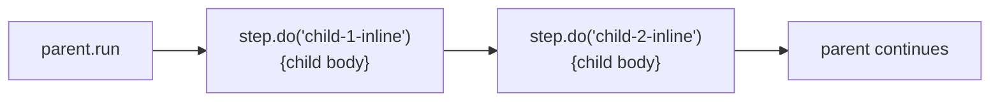
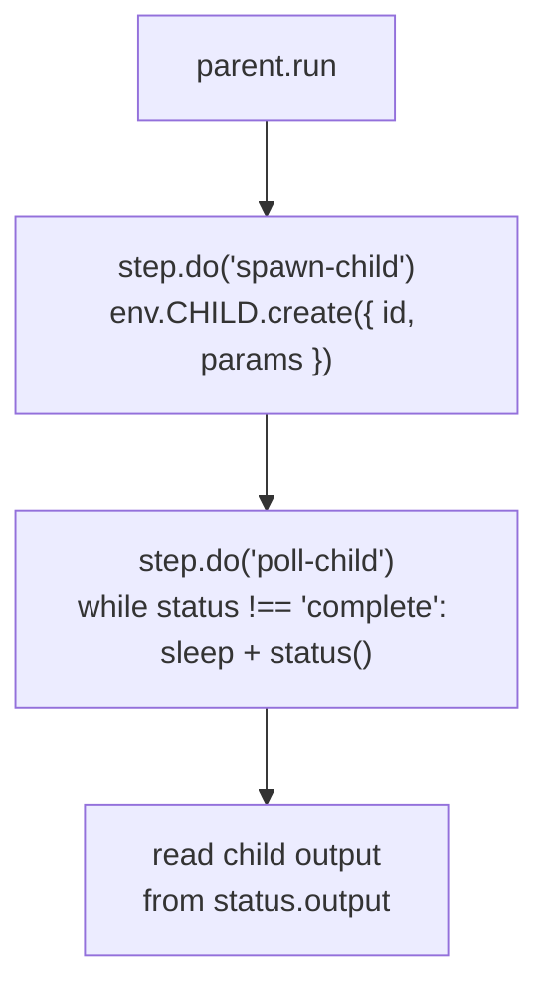
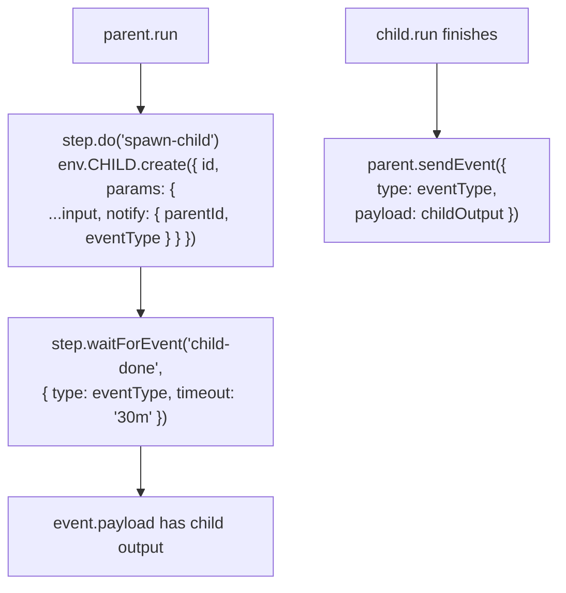
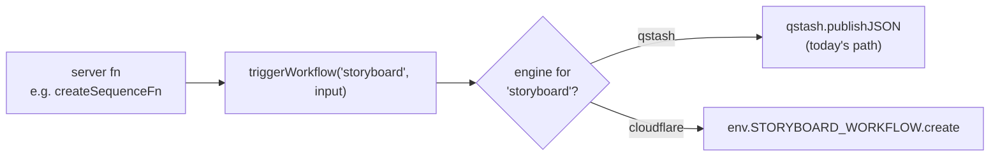

# Cloudflare Workflows vs Upstash QStash

**Status:** Investigation — no code changes. The decision to proceed is gated on a follow-up proof-of-concept (see [§7](#7-pilot-recommendation)).

**Audience:** Engineers who already understand the current pipeline. If you haven't read [`docs/developer-guide/workflow.md`](../developer-guide/workflow.md), start there.

**Question being answered (issue #728):** Can Cloudflare Workflows replace Upstash QStash for our durable workflow engine, and what's missing if we try?

---

## 1. Summary & recommendation

**Verdict:** Worth a proof-of-concept on `storyboardWorkflow` + `analyzeScriptWorkflow`. Do not migrate the whole pipeline blindly. The dominant unknown is sub-workflow ergonomics — we use `context.invoke()` 209 times across 30 workflows, and Cloudflare Workflows has no native equivalent that returns the child's value. Measure that gap before committing.

**Headline wins if we migrate**

- **Local dev:** `wrangler dev` runs an emulated Workflows engine. Drops the Docker QStash dependency from `bun dev`.
- **PR-preview isolation:** Workflow state is scoped per Worker deployment, which closes the class of bug behind [#725](https://github.com/openstory-so/openstory/issues/725) (PR-preview cross-contamination via shared QStash queues) — provided we adopt per-environment workflow naming as a convention.
- **Native primitives:** `step.sleep`, `step.sleepUntil`, `step.waitForEvent`, `pause/resume/terminate/restart` are first-class. We currently fake some of these (e.g. `motion-workflow.ts` does its own polling loop) and lack the rest.
- **Vendor consolidation:** We already deploy to Workers, store data in D1, and host assets in R2. Workflows live in the same control plane.
- **No HTTP signature verification needed:** Workflows are invoked internally via binding. The `serveMany()` route + signing-key plumbing goes away.

**Headline gaps**

- **No native sub-workflow `await`.** `BINDING.create()` spawns a child but returns immediately; awaiting completion needs `.status()` polling or a `step.waitForEvent` round-trip. `analyzeScriptWorkflow` alone has ~10 nested `context.invoke()` calls — the entire orchestration shape has to be reconsidered.
- **1 MB step result cap.** Some sub-workflows return large arrays (`characterBible[]`, `completeScenes[]`). Audit needed; mitigated by persisting intermediate results to D1 and passing IDs.
- **PR-preview isolation is convention, not automatic.** If two environments register the same workflow class under the same binding name and the same Worker name, they share state. Mitigation is operational discipline.
- **Streaming inside steps.** `scene-split-workflow.ts` writes frames progressively as LLM JSON streams in — that "side effects during a stream" pattern fights CF Workflows' "no side effects outside `step.do`" rule. Solvable, but a redesign.
- **5-min CPU per step.** Wall-clock per step is unlimited, but compute time is capped at 5 minutes on the paid plan. Most steps are short HTTP calls to Fal/OpenRouter; busy polling loops are the risk.

**Open questions the PoC must answer**

1. With ~30 parallel sub-workflows (Phase 4 frame images × N scenes × M models), does the chosen `await` pattern stay under the 5-min step CPU cap?
2. Does `wrangler dev`'s emulator honor `retries.backoff = 'exponential'`, multi-minute `step.sleep`, and `Promise.all([step.do(...)])` with the same semantics as production?
3. Do PR-preview deployments end up with truly isolated workflow state in practice, or does some shared registration (workflow class name, instance ID convention) leak?
4. Can the streaming scene parser run inside a single `step.do` without violating the 5-min CPU cap (a 9-scene script currently takes ~3min) and without losing the progressive frame-creation UX?

---

## 2. Current QStash usage profile

The full architecture lives at [`docs/developer-guide/workflow.md`](../developer-guide/workflow.md). What matters for this investigation is the **API surface we actually use** — most of QStash's feature catalog is unused, which narrows the migration target.

| Aspect                                          | Current QStash usage                                                        | Why it matters for Cloudflare Workflows                                                                                                                                                                               |
| ----------------------------------------------- | --------------------------------------------------------------------------- | --------------------------------------------------------------------------------------------------------------------------------------------------------------------------------------------------------------------- |
| Workflow count                                  | 30 in `src/lib/workflows/`                                                  | 30 `WorkflowEntrypoint` classes + 30 wrangler bindings if 1:1 ported                                                                                                                                                  |
| `context.run()`                                 | Heavy — checkpoints every external call                                     | Direct map to `step.do()`                                                                                                                                                                                             |
| `context.invoke()`                              | Heavy — 209 call sites across 30 workflows                                  | **No direct CF equivalent**; see Gap A                                                                                                                                                                                |
| `context.sleep` / `sleepUntil` / `waitForEvent` | **Not used anywhere**                                                       | Pure upside — CF natively supports them                                                                                                                                                                               |
| `context.call` / `api` / `notify`               | Not used                                                                    | N/A                                                                                                                                                                                                                   |
| Per-invoke retries                              | `retries: 3, retryDelay: pow(2, retried) * 1000`                            | CF: `retries: { limit, delay, backoff: 'exponential' \| 'linear' \| 'constant' }`                                                                                                                                     |
| Failure functions                               | Per-workflow handler emits realtime events on terminal failure              | CF: top-level throw → `errored` instance status; need a base class that emits our `generation.failed` event                                                                                                           |
| Streaming inside steps                          | `scene-split-workflow.ts` streams partial JSON, writes frames progressively | CF: `step.do` returns ≤1 MB serializable OR `ReadableStream<Uint8Array>`; per-chunk DB writes are awkward (Gap C)                                                                                                     |
| Polling loops                                   | `motion-workflow.ts` does ~30 × 30s polls (~15 min total)                   | Map cleanly to `step.sleep` + `step.do` checkpoint per poll iteration                                                                                                                                                 |
| Scoped DB middleware                            | `createScopedWorkflow()` + `validateSequenceAuth()`                         | Move to a base class extending `WorkflowEntrypoint`                                                                                                                                                                   |
| Signature verification                          | QStash signs webhooks; verified by `serveMany`                              | **Gone** — CF invokes workflows internally via binding; no HTTP boundary                                                                                                                                              |
| Local dev                                       | Docker QStash container                                                     | **Gone** — `wrangler dev` runs an emulated Workflows engine (Wrangler 4.79+)                                                                                                                                          |
| Realtime events                                 | `@upstash/realtime` channel per sequence                                    | **Unchanged** — independent of workflow engine                                                                                                                                                                        |
| Concurrency gating                              | None (removed in #726)                                                      | CF has no native concurrency gate either; per-account limit is 50k instances (paid). Won't reintroduce a #725-shaped bug because we won't have an application-level concurrency primitive to leak in the first place. |
| Snapshot / divergence validation                | Bespoke hash comparison at step boundaries                                  | Application-level; engine-agnostic; ports without changes                                                                                                                                                             |
| QStash schedules / DLQ / queues                 | Not used                                                                    | N/A                                                                                                                                                                                                                   |

**Workflows by sub-workflow depth** (relevant for migration ordering):

- **Leaves (no `context.invoke`):** `image`, `motion`, `music`, `character-sheet`, `location-sheet`, `library-talent-sheet`, `library-location-sheet`, `merge-video`, `merge-audio-video`, `shot-variant`, `upscale-shot-variant`, `element-vision`, `visual-prompt-scene`, `motion-prompt-scene`, `music-prompt`, `scene-split`
- **Mid-tier (1 layer of invokes):** `character-bible`, `location-bible`, `visual-prompt`, `motion-prompt`, `frame-images`, `regenerate-frames`, `replace-element`, `recast-character`, `recast-location`, `talent-matching`, `location-matching`
- **Orchestrators (2+ layers):** `storyboard` → `analyze-script` → all of Phases 1–5 (deepest tree); `motion-batch` → motion × N + music + merge
- **Mixed:** `motion-music-prompts` — single-layer parallel orchestrator

Leaf workflows are the natural starting points for a per-workflow migration.

---

## 3. Cloudflare Workflows reference summary

Captured as of May 2026 (Cloudflare Workflows is GA on both free and paid plans). Sources at the bottom of this doc. Numbers are paid-plan unless noted; assume changes after this date may invalidate parts of this section.

### 3.1 API surface

```typescript
import {
  WorkflowEntrypoint,
  type WorkflowEvent,
  type WorkflowStep,
} from 'cloudflare:workers';

export class MyWorkflow extends WorkflowEntrypoint<Env, Params> {
  async run(
    event: WorkflowEvent<Params>,
    step: WorkflowStep
  ): Promise<MyResult> {
    // any JS control flow: if / for / try-catch / Promise.all
  }
}
```

- `WorkflowEvent<T> = { payload: Readonly<T>; timestamp: Date; instanceId: string }`
- `event.payload` is read-only; mutate via step return values, never in-place

**Step methods**

```typescript
step.do(name: string, callback: (ctx) => RpcSerializable): Promise<T>
step.do(name: string, config: WorkflowStepConfig, callback): Promise<T>

step.sleep(name: string, duration: WorkflowDuration): Promise<void>
step.sleepUntil(name: string, timestamp: Date | number): Promise<void>

step.waitForEvent(name: string, options: {
  type: string;          // ≤100 chars
  timeout?: string | number; // default 24h
}): Promise<void>
```

```typescript
type WorkflowStepConfig = {
  retries?: {
    limit: number;
    delay: string | number;
    backoff?: 'constant' | 'linear' | 'exponential';
  };
  timeout?: string | number;
};
```

**Instance management**

```typescript
declare abstract class WorkflowInstance {
  public id: string;
  public pause(): Promise<void>;
  public resume(): Promise<void>;
  public terminate(): Promise<void>;
  public restart(options?: WorkflowInstanceRestartOptions): Promise<void>;
  public status(): Promise<InstanceStatus>;
  public sendEvent(options: { type: string; payload?: unknown }): Promise<void>;
}

type InstanceStatus = {
  status:
    | 'queued'
    | 'running'
    | 'paused'
    | 'errored'
    | 'terminated'
    | 'complete'
    | 'waiting'
    | 'waitingForPause'
    | 'unknown';
  error?: { name: string; message: string };
  output?: unknown;
};
```

**Binding API (from Worker code, e.g. our server functions)**

```typescript
env.IMAGE_WORKFLOW.create({ id, params }): Promise<WorkflowInstance>
env.IMAGE_WORKFLOW.createBatch([...]): Promise<WorkflowInstance[]>  // ≤100
env.IMAGE_WORKFLOW.get(id): Promise<WorkflowInstance>
```

Bindings are declared in `wrangler.jsonc`:

```jsonc
{
  "workflows": [
    {
      "name": "image-workflow",
      "binding": "IMAGE_WORKFLOW",
      "class_name": "ImageWorkflow",
    },
    // ...×30
  ],
}
```

### 3.2 Limits (paid plan)

| Limit                                  | Value                                               |
| -------------------------------------- | --------------------------------------------------- |
| Concurrent instances per account       | 50,000                                              |
| Steps per workflow (default)           | 10,000                                              |
| Steps per workflow (max, configurable) | 25,000                                              |
| CPU time per step                      | 30s default, configurable to 5 min                  |
| Wall-clock time per step               | Unlimited                                           |
| Workflow total duration                | Unlimited (within step caps)                        |
| Step result (non-stream)               | 1 MiB                                               |
| Stream step result                     | `ReadableStream<Uint8Array>`, no hard cap published |
| Event payload                          | 1 MiB                                               |
| Instance creation rate                 | 300/s/account, 100/s/workflow                       |
| Max retries per step                   | 10,000                                              |
| State retention                        | 30 days after terminal status                       |
| Instance ID                            | ≤100 chars                                          |
| Step name                              | ≤256 chars                                          |
| Event type name                        | ≤100 chars                                          |
| `step.sleep` / `step.sleepUntil`       | Don't count toward step limit                       |

Free-plan delta: 100 concurrent instances, 1,024 steps, 10ms CPU per step (essentially unusable), 100 MB state, 3-day retention. We'll be on paid.

### 3.3 Rules

- **Determinism.** Step names must be deterministic (they're cache keys for replay).
- **Side effects in `step.do` only.** Random numbers, `Date.now()`, DB writes, network calls — all must live inside a `step.do` callback. The outer `run()` body should only orchestrate.
- **Idempotency recommended but not required.** Failed retries may re-execute a step, so external operations should be safe to repeat (we already follow this for D1 upserts).
- **`Promise.all([step.do(...)])` is idiomatic.** The docs explicitly support and recommend it for parallelism; all return values are persisted by the engine.
- **Errors retry by default.** A thrown error inside `step.do` consumes a retry up to `retries.limit`, then surfaces as the step's failure. After `retries.limit` exhausts, the workflow itself errors and `run()`'s caller sees an `errored` instance.

### 3.4 Local development

- `wrangler dev` (Wrangler 4.79+) runs an emulated Workflows engine in-process. No Docker, no external services.
- CLI: `wrangler workflows ... --local` for instance management, history, and triggering.
- **Not supported** with `wrangler dev --remote`. Workflows are local-only in dev mode.

---

## 4. Gap analysis

For each non-trivial QStash feature we use, this section maps it to a CF Workflows primitive and identifies the work required.

### Gap A — Sub-workflow await (highest risk)

QStash's `context.invoke('child', input)` does three things in one call:

1. Creates a child workflow instance
2. Blocks the parent until the child finishes
3. Returns the child's output to the parent

Cloudflare Workflows does (1) via `BINDING.create({ id, params })` but **not (2) or (3)**. The parent has to drive completion-detection itself. Three candidate patterns:

#### Pattern 1 — Inline `step.do` (flatten the child)



The child workflow's body is inlined as a `step.do` in the parent. Works for small leaf workflows. Fails for `analyzeScriptWorkflow` (would balloon to thousands of lines, lose retry isolation per child, and double the orchestrator's step count).

Use case: leaf workflows the parent currently invokes once with no parallelism (e.g. inlining `mergeAudioVideoWorkflow` into `mergeVideoWorkflow`).

#### Pattern 2 — `create()` + poll `.status()`



Spawn the child, then enter a polling loop inside a `step.do`. Burns parent step count (one step per poll iteration if you checkpoint each one) and parent CPU (5-min cap). Bad for fan-out with many children — you'd serialize the polls or chew CPU running them in parallel.

Use case: fire-and-forget children where the parent doesn't need the return value at all (e.g. preview-image triggers from `sceneSplitWorkflow`).

#### Pattern 3 — `create()` + `step.waitForEvent` (**recommended for PoC**)



Parent spawns the child with a notify-event hint in the child's params. The child's last step calls `env.PARENT_WORKFLOW.get(parentId).sendEvent(...)` with the output. The parent's `step.waitForEvent` returns when that arrives. One extra step per invoke, but no busy polling.

**Open question for PoC:** what happens if the child errors? `step.waitForEvent` only wakes on a matching event. If the child fails before sending the event, the parent hangs until the 24h (default) or chosen timeout. Mitigation: a base class wrapping `run()` in try/catch that sends a `*.failed` event before rethrowing. Adds ~20 lines per workflow if not abstracted.

**Fan-out (e.g. Phase 4 frame-images × 20 scenes):** the same pattern handles N children. Spawn all N in parallel via `Promise.all([step.do('spawn-i', ...)])`, give each child a **unique event type** (e.g. `type: \`image-done:${childId}\``) so there's no ambiguity about which waiter gets which event, then `Promise.allSettled([step.waitForEvent(...)])` over all N waits.

```typescript
const childIds = await Promise.all(
  scenes.map((scene, i) =>
    step.do(`spawn-image-${i}`, async () => {
      const childId = `image:${sequenceId}:${scene.id}`;
      const notifyType = `image-done:${childId}`;
      await env.IMAGE_WORKFLOW.create({
        id: childId,
        params: { ...scene, parentId: event.instanceId, notifyType },
      });
      return { childId, notifyType };
    })
  )
);

const results = await Promise.allSettled(
  childIds.map(({ notifyType }, i) =>
    step.waitForEvent(`await-image-${i}`, { type: notifyType, timeout: '30m' })
  )
);
```

Confirmed by the docs: **events are buffered** — a child that finishes and `sendEvent`s before the parent reaches `step.waitForEvent` does not lose the event; the engine holds it until the matching `waitForEvent` runs. This means spawn-then-await in parallel is safe and we don't have to serialize spawn/wait.

**`Promise.allSettled` (not `Promise.all`)** matters because a single child timing out throws inside its waiter. With `Promise.all`, one stuck waiter trips the parent. With `allSettled`, the successful children's results are available and we can apply per-child fallback logic (matches today's per-frame retry policy).

**Still to verify in the PoC** (docs don't explicitly say):

- Same-type consumption semantics with two waiters on the same `type`. Sidestepped by using a unique type per child; verify the unique-type pattern actually behaves as expected at N=20+.
- Whether there's a hard cap on concurrent `waitForEvent` calls per instance. Likely no (waits don't consume step CPU), but measure at our worst-case fan-out (~50× for frame-images × scenes × models).

**Output passing under 1 MiB cap:** event payload is also 1 MiB. Larger children should persist their full output to D1 keyed by the workflow instance ID, and the event payload should be just the ID. Parent reads from D1 after the event fires. Same approach as Gap B.

**Cost of fan-out:** with 9 scenes × 4 sub-workflows per scene = 36 invokes per analyze-script run, each pattern-3 invoke is `create + waitForEvent + sendEvent`. The `step.sleep` + `step.waitForEvent` time doesn't count toward step CPU, so fan-out is safe. The 25k step ceiling is far above what we'd hit.

#### Decision

For the PoC: use Pattern 3 by default. Use Pattern 1 only for `mergeVideoWorkflow → mergeAudioVideoWorkflow` and similar simple chains. Use Pattern 2 only for genuine fire-and-forget (where today we already do `triggerWorkflow(...)` without awaiting, as in `sceneSplitWorkflow`'s preview-image trigger).

### Gap B — Output payload size (medium risk)

Each `step.do` return value caps at 1 MiB. We don't have measured numbers for our biggest payloads, but candidates to audit:

- `characterBible[]` returned from `talentMatchingWorkflow` — per-character description + clothing + consistency tags, ~5-10 characters for a typical sequence. Likely safe.
- `completeScenes[]` returned from `motionMusicPromptsWorkflow` — per-scene visual prompts (multi-paragraph), motion prompts, music design metadata. **At risk** for 20+ scene sequences.
- `frameMapping[]` from `sceneSplitWorkflow` — array of `{ sceneId, frameId }`. Trivial size.

Mitigation: persist child output to D1 (most of it already lives there in `frames.metadata`), then have child steps return only IDs / hashes. Audit during PoC; design a helper `persistAndReturnRef(childOutput) → { ref: 'd1://...', summary: {...} }` if a pattern emerges.

### Gap C — Streaming scene parsing (medium risk)

`sceneSplitWorkflow` is the only workflow with a streaming side-effect pattern:

```text
LLM stream → partial-json parser →
  per-chunk: upsertFrame(), emit generation.scene:new, fire-and-forget preview image
→ final reconcile (bulkInsertFrames)
```

CF Workflows says side effects must live inside a `step.do`. Three options:

1. **Wrap the entire stream in one `step.do`.** The step body opens the stream, parses, performs DB writes and event emissions inline, and returns the final reconcile result. Pros: minimal redesign, side effects are inside the step boundary. Cons: a 3-minute streaming run is a single non-checkpointed step; if it fails partway, the retry replays the whole LLM call. Today QStash has the same problem (the streaming step isn't fine-grained either) — call this **acceptable** for the PoC.
2. **Return `ReadableStream<Uint8Array>` from a step, drive consumer outside.** Allowed by CF Workflows for binary output, but the consumer would be back in the workflow's `run()` body, where side effects are disallowed. Doesn't fit our pattern.
3. **Move the streaming parser to a Durable Object.** The DO holds the stream state and emits events; the workflow `step.do`s call into the DO and poll for completion. Pros: nicer fault model; cons: significant new infrastructure for one workflow.

**Recommendation:** option 1 for the PoC. Re-evaluate if the failure replay cost is unacceptable in practice.

### Gap D — Failure-function realtime events (low risk)

Today, each workflow registers a `failureFunction` that sanitizes errors (`sanitizeFailResponse`) and emits `generation.failed`. CF Workflows doesn't expose a failure-function hook; failures surface via `InstanceStatus.status === 'errored'` and `InstanceStatus.error`.

Mitigation: base class.

```typescript
export abstract class OpenStoryWorkflow<Env, Params> extends WorkflowEntrypoint<
  Env,
  Params
> {
  abstract runImpl(
    event: WorkflowEvent<Params>,
    step: WorkflowStep
  ): Promise<unknown>;

  async run(event: WorkflowEvent<Params>, step: WorkflowStep) {
    try {
      return await this.runImpl(event, step);
    } catch (error) {
      const sanitized = sanitizeFailResponse(error);
      await step.do('emit-failure', () =>
        emitGenerationFailed(event.payload, sanitized)
      );
      throw error;
    }
  }
}
```

~30 LOC. The `emit-failure` step must itself be wrapped against its own failure (don't let the cleanup throw and swallow the original error).

### Gap E — Local dev parity (low risk, but worth validating)

The `wrangler dev` emulator advertises full Workflows support. The PoC should explicitly verify:

- `retries.backoff = 'exponential'` produces the expected delays locally
- `step.sleep('30m')` works without short-circuiting (some emulators collapse multi-minute sleeps)
- `Promise.all([step.do(...)])` actually runs in parallel and persists each return independently
- `step.waitForEvent` correctly blocks and resumes on `sendEvent`
- Workflow instance state survives a restart of `wrangler dev` (durability is the whole point)

If any of these are emulated incorrectly, our local dev story silently diverges from production — worth knowing up front.

### Gap F — PR-preview isolation (high impact, mostly operational)

The #725 root cause: QStash queues are global per account; a PR-preview deploy that publishes to the same queue path as production can have its messages picked up by production handlers (or vice versa). The fix landed in #726 was to remove `flowControl`, but the queue-sharing problem itself persists at low risk.

CF Workflows scopes workflow state per Worker deployment. **However**, two deployments can share state if:

- They register the same workflow class (`class_name`) in the same Worker (`script_name`)
- They use the same `binding` name in different environments but reuse instance IDs (`env.IMAGE_WORKFLOW.create({ id: 'seq-123' })` is global per Worker, not per environment)

Today our PR previews share a Worker script with production (single-script multi-environment). If we keep that, two deployments writing instances with the same ID would conflict.

**Mitigation options for the PoC:**

- **Option A — namespace instance IDs by environment:** `image-workflow:${env.ENVIRONMENT}:${sequenceId}`. Cheap; we control the ID. No risk of cross-talk.
- **Option B — per-environment Worker scripts:** would require a wrangler config rework. Larger blast radius.

The PoC must produce a written runbook entry for this. The constraint isn't "if you forget, things crash" — it's "if you forget, two environments silently see each other's instances."

### Gap G — Workflow registration & routing (low risk)

Today's HTTP entry point is `src/routes/api/workflows/$.ts` with `serveMany()` from `@upstash/workflow/tanstack`. Triggers are HTTP POSTs from `triggerWorkflow()` (`src/lib/workflow/client.ts`) to that route, signed by QStash.

With CF Workflows, that route disappears. Triggers become:

```typescript
const instance = await env.IMAGE_WORKFLOW.create({
  id: `image:${sequenceId}:${frameId}`,
  params: input,
});
```

This collapses the trigger path. `triggerWorkflow(path, body)` becomes a single switch point — perfect for the per-workflow rollout the user picked. Sketch:

```typescript
// src/lib/workflow/client.ts
export async function triggerWorkflow(
  workflowName: string,
  input: WorkflowInput
) {
  const engine = getEngineForWorkflow(workflowName); // returns 'qstash' | 'cloudflare'
  if (engine === 'cloudflare') {
    const binding = getCfBindingFor(workflowName);
    const instance = await binding.create({
      id: generateId(workflowName, input),
      params: input,
    });
    return { workflowRunId: instance.id };
  }
  // ... existing QStash path
}
```

The selector reads from a registry (env var or `src/lib/workflow/engine-map.ts`). Per-workflow switch flag, default to QStash, flip leaves first.

### Gap H — Auto-minted webhook URLs (forward-looking, medium effort once)

We don't use external webhook callbacks today, but the option has come up (e.g. replacing the 15-min motion polling loop with a fal.ai webhook). QStash has a first-class primitive for this:

```typescript
const webhook = await context.createWebhook('step-name');
// pass webhook.webhookUrl to the external service
const result = await context.waitForWebhook('step-name');
// result is the POST body delivered when the external service hits the URL
```

The engine mints a unique URL tied to instance + step, handles the inbound POST, and resumes the step with the body. Two lines.

**CF Workflows has no equivalent.** You compose the same capability from existing primitives:

```typescript
// in the workflow
await step.do('submit', () =>
  fal.submit({
    ...params,
    webhook_url: `${env.PUBLIC_URL}/api/webhooks/fal?instance=${event.instanceId}&job=${jobId}`,
  })
);
const callback = await step.waitForEvent('fal-done', {
  type: `fal:${jobId}`,
  timeout: '30m',
});

// in a new route: src/routes/api/webhooks/fal.ts
// (~30–50 LOC: parse, verify signature, lookup instance, sendEvent)
const instance = await env.MOTION_WORKFLOW.get(instanceId);
await instance.sendEvent({
  type: `fal:${jobId}`,
  payload: await request.json(),
});
```

| Concern                         | QStash                              | CF Workflows                                             |
| ------------------------------- | ----------------------------------- | -------------------------------------------------------- |
| URL minting                     | Engine returns a unique URL         | We construct it (semantic IDs, optional HMAC)            |
| HTTP receiver                   | Built in                            | One route handler per webhook source                     |
| Provider sigverify (fal/Stripe) | Our responsibility either way       | Our responsibility, lives at the route boundary          |
| Concept count                   | Separate `waitForWebhook` primitive | Same `waitForEvent` used for parent/child fan-in (Gap A) |
| Per-source one-time cost        | None                                | ~30–50 LOC for the route + sigverify + lookup            |
| Per-workflow-step cost          | ~2 LOC                              | ~5 LOC                                                   |

**Net:** real DX delta but bounded and one-time per external service. The CF model has compensating wins (sigverify at the boundary, one primitive for both fan-in cases, full control over URL shape and auth). Not a migration blocker; flagged here because it changes how we'd evaluate forward-looking webhook integrations against staying on QStash.

---

## 5. Reliability assessment

Reframing each known failure mode against CF Workflows.

| Failure mode                                                                                  | Today (QStash)                                                                                                     | With CF Workflows                                                                                                                                                                                                                                       |
| --------------------------------------------------------------------------------------------- | ------------------------------------------------------------------------------------------------------------------ | ------------------------------------------------------------------------------------------------------------------------------------------------------------------------------------------------------------------------------------------------------- |
| PR-preview cross-contamination ([#725](https://github.com/openstory-so/openstory/issues/725)) | Possible via shared queues                                                                                         | **Possible if we don't namespace instance IDs.** Resolves to operational discipline (Gap F). Mitigation is mechanical (one line in `generateId`) but must be enforced.                                                                                  |
| Ghost slot leaks on cancel                                                                    | Was the root cause of `flowControl` removal in #726                                                                | **N/A.** CF Workflows has no `flowControl`-equivalent primitive to leak. We won't reintroduce this class of bug because we won't have the primitive in the first place.                                                                                 |
| Deploy-induced wedging                                                                        | QStash messages mid-flight may be rejected by a Worker that's been redeployed (signature mismatch / route change). | **Improved.** CF Workflow instances are durable across Worker deploys. Step state is persisted; deploys don't drop in-flight work.                                                                                                                      |
| Stuck runs (no admin)                                                                         | Manual triage via Upstash console; no production "kill" affordance from our side                                   | **Improved.** `instance.terminate()` is a one-liner; we could wire it into an admin route.                                                                                                                                                              |
| Concurrency-induced rate limit failures                                                       | We rely on Fal's server-side queue (`IN_QUEUE`) + OpenRouter native limits                                         | **Same.** CF Workflows has no concurrency gate. We continue to lean on upstream queues. The 50k concurrent instances ceiling is far above our worst case (~50 active sequences × ~10 sub-instances = 500).                                              |
| Workflow class hot-deploy mid-flight                                                          | QStash workflows reload on each request (handler is stateless)                                                     | **Same outcome, different mechanism.** CF Workflows continue executing the deployed-at-spawn-time code by default; behavior on class re-deploy is documented as continuing with the original code unless `restart()` is called. Net result: equivalent. |
| Step-level retries                                                                            | QStash auto-retries internally (we don't configure per-step)                                                       | **More explicit.** `step.do` accepts a retry config; we can make backoff/delay/limit per-step rather than per-workflow.                                                                                                                                 |
| New failure mode introduced                                                                   | —                                                                                                                  | **Sub-workflow await glue.** If the Pattern 3 implementation has a bug, parents could hang on `step.waitForEvent` timeouts (default 24h). PoC must exercise mid-flight `terminate()` of children while the parent waits.                                |

**Net assessment:** CF Workflows is a meaningful reliability upgrade _if_ the sub-workflow await glue is solid. The single largest risk is creating a new failure mode in that glue (parent hangs on a child that erred without sending its `*.failed` event). The base-class wrapper proposed in Gap D mitigates this, but the PoC must verify it.

---

## 6. DX assessment

| Dimension                       | Today (QStash)                                                               | With CF Workflows                                                                                                                                            |
| ------------------------------- | ---------------------------------------------------------------------------- | ------------------------------------------------------------------------------------------------------------------------------------------------------------ |
| Local dev setup                 | `bun dev` requires Docker daemon running + Docker image pulled               | `bun dev` runs `wrangler dev`. No Docker. Big win for new contributors.                                                                                      |
| Observability — workflow runs   | Upstash QStash console                                                       | CF dashboard: instance list, step history, errors per instance, retry counts                                                                                 |
| Observability — LLM traces      | Langfuse (via `record-workflow-trace` step)                                  | Unchanged — engine-agnostic                                                                                                                                  |
| Observability — frontend events | PostHog + Upstash Realtime channel                                           | Unchanged — Realtime is independent of QStash                                                                                                                |
| Type safety                     | `WorkflowContext<Input>` generic on payload                                  | `WorkflowEntrypoint<Env, Params>` generic on env + payload. Equivalent shape.                                                                                |
| Wrangler config burden          | None for workflows (QStash is external)                                      | +30 entries in `workflows[]` array. Manageable but verbose. Recommend generating it from `src/lib/workflows/registry.ts` at build time.                      |
| Test setup                      | Workflow context is mocked per-suite (`mock.module('@/lib/db/client', ...)`) | CF doesn't ship a Workflows test harness. We'd write a `step` mock (~50 LOC) that records step names and runs callbacks synchronously. Same DX once written. |
| Failure debugging               | QStash message-by-message replay via console                                 | CF: per-instance step history with input/output of each step. Equivalent or better.                                                                          |
| CI duration                     | `bun test` runs against mocks (no engine)                                    | Same. CI doesn't invoke the engine.                                                                                                                          |
| Rollback story                  | Revert a workflow change → next QStash invocation uses new code              | Same. CF Workflows reload on deploy (with the caveat that in-flight instances finish on their original code).                                                |

**Net DX assessment:** Local dev is a substantial win. Wrangler config bloat is the only meaningful cost, and generation can paper it over.

---

## 7. Pilot recommendation

**Pilot workflow:** `storyboardWorkflow` + `analyzeScriptWorkflow` (and its transitive sub-workflows).

**Rationale:** It's the deepest sub-workflow tree we have — Phase 1 streaming + Phase 2/3/4 parallel fan-out + Phase 5 conditional cascade. If CF Workflows can run this end-to-end with acceptable performance, every other workflow in the pipeline is a strictly simpler problem.

**PoC success criteria** (write these into the follow-up issue body):

| Criterion                                          | Measurement                                                                                                                                                     |
| -------------------------------------------------- | --------------------------------------------------------------------------------------------------------------------------------------------------------------- |
| End-to-end wall time on a 9-scene script           | ≤ +20% vs QStash baseline (current ~9-10 min total; see [`workflow.md` line 84](../developer-guide/workflow.md))                                                |
| Realtime events fire identically                   | Manual diff of `generation.*` event stream against a QStash baseline for the same script                                                                        |
| Mid-flight `terminate()` cleans up children        | Run a sequence, terminate the parent at Phase 3, verify no orphaned child instances in `wrangler workflows list`                                                |
| PR-preview isolation works                         | Deploy the same workflow to two PR-preview Worker environments, run a sequence in each with the same `sequenceId`, verify they don't see each other's instances |
| `bun dev` runs the workflow locally with no Docker | Remove QStash Docker step, run sequence, observe end-to-end completion                                                                                          |
| Output payloads stay under 1 MiB                   | Log step return sizes during a 20-scene run; flag any over 800 KiB                                                                                              |
| Step CPU never exceeds 5 min                       | CF dashboard inspection during PoC runs                                                                                                                         |
| Failure-function parity                            | Force a sub-workflow to throw; verify `generation.failed` fires once, with sanitized message                                                                    |
| `wrangler dev` emulator parity                     | Spot-check `step.sleep('5m')`, `Promise.all`, and `step.waitForEvent` against the documented production semantics                                               |

**Out of scope for the PoC:**

- Migrating any other workflow
- Removing QStash dependencies
- Updating production wrangler config (PoC runs alongside QStash, behind the per-workflow switch)
- Cost analysis with real numbers (do that after the PoC produces a usage profile)

---

## 8. Rollout sketch

Only relevant if the PoC succeeds. User chose **per-workflow switch** as the preferred rollout shape.

### Switch architecture



`src/lib/workflow/client.ts:triggerWorkflow()` consults a registry. The registry is a TS map keyed by workflow name with values `'qstash' | 'cloudflare'`. Default everything to `'qstash'`. Flip leaves first.

### Migration order (reverse-topological from invoke graph)

1. **Phase A — leaves with no upstream dependencies.** `image`, `motion`, `music`, `character-sheet`, `location-sheet`, `library-talent-sheet`, `library-location-sheet`, `merge-video`, `merge-audio-video`, `shot-variant`, `upscale-shot-variant`, `element-vision`. These have no `context.invoke` callers above them in their own subtree — port without touching parents.
2. **Phase B — mid-tier orchestrators.** `character-bible`, `location-bible`, `visual-prompt`, `motion-prompt`, `frame-images`, `regenerate-frames`, `replace-element`, `recast-character`, `recast-location`, `talent-matching`, `location-matching`, `motion-music-prompts`. These invoke leaves. Each port introduces one Pattern-3 sub-workflow await per leaf.
3. **Phase C — top-level orchestrators.** `motion-batch`, `analyze-script`, `storyboard`. These have the most invokes and the most surface area to get wrong.
4. **Phase D — scene-split** (Gap C). The streaming workflow is the highest-risk port; do it last so leaf-level patterns are battle-tested first.
5. **Phase E — remove QStash.** Delete `triggerWorkflow`'s QStash branch, remove `serveMany` route, remove Docker QStash from `bun dev`, drop `@upstash/workflow` and `@upstash/qstash` packages, scrub env vars.

### Kill criteria

Abandon the migration and stay on QStash if any of these become true during Phase A or B:

- Pattern 3 sub-workflow await requires >150 LOC of glue (suggests the abstraction is fighting the engine, not riding it).
- PR-preview isolation needs operational discipline that's hard to enforce automatically (e.g. >2 places where a developer must remember to namespace).
- Local dev emulator diverges from production semantics in a way that breaks our test fixtures (specifically: `Promise.all` parallelism, `step.waitForEvent` ordering, or retry backoff).
- Wall-time regression >50% on a representative sequence after optimization.

---

## 9. Decision

**Pending PoC.** This section to be filled in after the follow-up issue completes.

**Inputs required to make the call (the PoC must produce all of these):**

- Wall-time table: QStash vs CF Workflows on a 9-scene and 20-scene sequence
- Step CPU usage table: peak step CPU time per workflow in the PoC
- Step result payload size distribution: per-step max bytes
- Sub-workflow await glue line count: total LOC added for Pattern 3 + base class
- PR-preview isolation: pass/fail with the namespacing strategy
- Failure replay behavior: pass/fail on parent `terminate()` while children running
- DX delta: time-to-first-successful-local-run for a new contributor with and without Docker

**Decision rubric:**

| Outcome                                                    | Action                                                                         |
| ---------------------------------------------------------- | ------------------------------------------------------------------------------ |
| All success criteria met, ≤+10% wall time                  | Begin Phase A migration                                                        |
| All criteria met, +10–20% wall time                        | Begin Phase A; reassess after each phase                                       |
| Sub-workflow glue >150 LOC OR PR-preview isolation fragile | Stay on QStash, document findings                                              |
| Streaming workflow can't fit (Gap C)                       | Migrate everything except `scene-split`; keep one QStash workflow indefinitely |
| Local dev emulator diverges materially                     | Stay on QStash                                                                 |
| Cost projection (run during PoC) > 2× QStash               | Stay on QStash                                                                 |

---

## 10. Appendix: sources

**Cloudflare Workflows docs (May 2026):**

- API reference: `https://developers.cloudflare.com/workflows/build/workers-api/`
- Limits: `https://developers.cloudflare.com/workflows/reference/limits/`
- Rules & best practices: `https://developers.cloudflare.com/workflows/build/rules-of-workflows/`
- Local development: `https://developers.cloudflare.com/workflows/build/local-development/`

**Internal references:**

- [`docs/developer-guide/workflow.md`](../developer-guide/workflow.md) — current QStash architecture
- PR [#726](https://github.com/openstory-so/openstory/pull/726) (closes [#725](https://github.com/openstory-so/openstory/issues/725)) — `flowControl` removal that motivated this investigation
- `src/lib/workflows/*` — 30 workflow definitions
- `src/routes/api/workflows/$.ts` — current HTTP entry point (`serveMany`)
- `src/lib/workflow/client.ts` — `triggerWorkflow()` (the rollout switch point)
- `wrangler.jsonc` — D1 + R2 bindings; would add 30 workflow bindings on migration

**Gaps in this investigation (questions left for the PoC, not for further desk research):**

- Cost model with hard numbers — Cloudflare's pricing page didn't yield a defensible per-step cost without a usage profile. The PoC produces the usage profile.
- Sub-workflow patterns in the Cloudflare docs — the dedicated "sub-workflows" page 404'd. Pattern 3 is inferred from the documented `sendEvent` / `waitForEvent` primitives and is the natural composition; the PoC must verify it works as designed.
- Exact emulator semantics in `wrangler dev` — listed under success criteria for the PoC rather than guessed at here.
